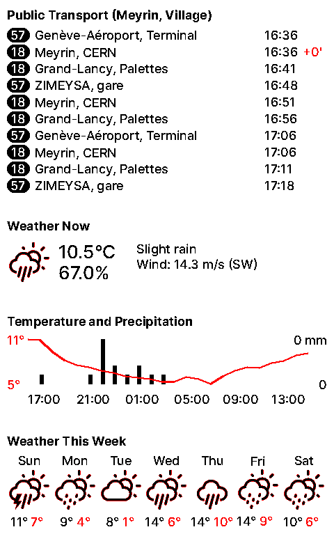

# Monitor: an e-Paper smart display script

This is a script that runs on a Raspberry Pi equipped with a Waveshare 7.5B
e-Paper display. Given a name of the stop (currently supports only the stops
available on the [transport.opendata.swiss](transport.opendata.swiss) API), it 
will display the next departures from that stop, as well as the current weather
conditions in the area. The weather is fetched using the [open-meteo.com](open-meteo.com)
API.

No doubt the code can be adapted to other e-Paper displays, but I have not
done so.

## License

This project is licensed under the MIT license. See the LICENSE file for more
details. Additionally, the project depends on assets created by others, which,
while attached to this project, are licensed under their own terms.

The 'Inter' font used in the script is licensed under the SIL  Open Font 
License, version 1.1. See the [monitor/res/fonts/LICENSE.txt](monitor/res/fonts/LICENSE.txt)
file for more details.

The weather icons used in the script are likewise licensed under the SIL Open
Font License, version 1.1. See the [monitor/res/svg/README.txt](monitor/res/svg/README.txt)
file for more details.

## Example



## Installation and usage

The script can be installed using poetry simply by running `poetry install`.

The script can be run using `poetry run monitor run`:

```
Usage: monitor run [OPTIONS]

Options:
  -o, --output [pil|epd]   How to display the image.
  -f, --flip               If set, the image will be rotated by 180°.
  -t, --transit-stop TEXT  Name of the public transport stop or station to
                           monitor.  [required]
  -d, --delay INTEGER      Delay in seconds before refreshing the display.
                           Zero value means the display will only be refreshed
                           once, after which the program will exit.
  --help                   Show this message and exit.
```

The option `--output` can be used to specify how the image should be displayed.
The default is `pil`, which will display the image in a window, which is useful
for debugging. The other option is `epd`, which will display the image on the
e-Paper display.

## Installing as a systemd service

Assuming the repo has been clone at `/home/pi/monitor`, and you have a default
installation of poetry on your system, you can simply copy the `monitor.service`
file to `/etc/systemd/system/` and enable the service:

```
sudo cp /home/pi/monitor/monitor.service /etc/systemd/system/
sudo systemctl enable monitor.service
sudo systemctl start monitor.service
```

In case of a different setup you will need to edit the service file. If you
encounter errors you can check the logs using `journalctl -u monitor.service`.
